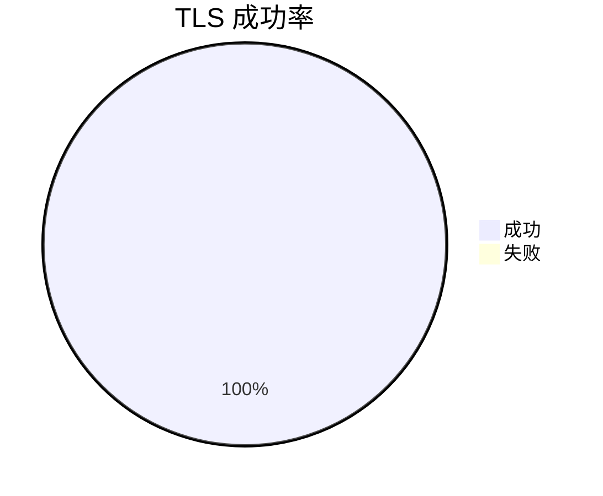

数据更新时间: 2025-10-03 17:23:31

分层统计: TLS ✅ 29/29 | TCP443 ✅ 29/29 | TCP80 ✅ 29/29 | HTTP(80) ✅ 29/29 | HTTPS(443) ✅ 29/29

### 可视化

#### TLS 成功率

#### 延迟柱状图（Top 15）

| 域名 | IP | TCP443 | TCP80 | TLS 握手 | HTTP(80) | 状态码 | HTTPS(443) | 状态码(HTTPS) | 延迟(ms) |
|---|---|---|---|---|---|---|---|---|---|
| [cdn.akamai.steamstatic.com](https://cdn.akamai.steamstatic.com/) | 23.207.202.173 | ✅ | ✅ | ✅ | ✅ | 200 | ✅ | 200 | 108.88 |
| [epicgames.com](https://epicgames.com/) | 54.224.164.236 | ✅ | ✅ | ✅ | ✅ | 301 | ✅ | 302 | 151.09 |
| [unrealengine.com](https://unrealengine.com/) | 3.227.133.49 | ✅ | ✅ | ✅ | ✅ | 301 | ✅ | 301 | 145.2 |
| [community.akamai.steamstatic.com](https://community.akamai.steamstatic.com/) | 23.207.202.197 | ✅ | ✅ | ✅ | ✅ | 403 | ✅ | 403 | 190.82 |
| [store.akamai.steamstatic.com](https://store.akamai.steamstatic.com/) | 23.54.127.122 | ✅ | ✅ | ✅ | ✅ | 403 | ✅ | 403 | 189.8 |
| [fortnite.com](https://fortnite.com/) | 54.173.96.7 | ✅ | ✅ | ✅ | ✅ | 301 | ✅ | 301 | 203.89 |
| [origin.com](https://origin.com/) | 23.213.79.115 | ✅ | ✅ | ✅ | ✅ | 301 | ✅ | 301 | 207.68 |
| [steamcdn-a.akamaihd.net](https://steamcdn-a.akamaihd.net/) | 23.215.0.133 | ✅ | ✅ | ✅ | ✅ | 200 | ✅ | 200 | 239.88 |
| [launcher-public-service-prod06.ol.epicgames.com](https://launcher-public-service-prod06.ol.epicgames.com/) | 104.18.13.27 | ✅ | ✅ | ✅ | ✅ | 404 | ✅ | 404 | 277.58 |
| [easyanticheat.net](https://easyanticheat.net/) | 104.18.3.180 | ✅ | ✅ | ✅ | ✅ | 301 | ✅ | 301 | 315.14 |
| [steam-chat.com](https://steam-chat.com/) | 23.213.69.74 | ✅ | ✅ | ✅ | ✅ | 302 | ✅ | 404 | 323.4 |
| [www.steamcommunity.com](https://www.steamcommunity.com/) | 23.213.69.74 | ✅ | ✅ | ✅ | ✅ | 302 | ✅ | 302 | 244.97 |
| [api.steampowered.com](https://api.steampowered.com/) | 23.214.233.226 | ✅ | ✅ | ✅ | ✅ | 404 | ✅ | 404 | 306.06 |
| [ea.com](https://ea.com/) | 23.220.130.177 | ✅ | ✅ | ✅ | ✅ | 301 | ✅ | 301 | 143.08 |
| [ubi.com](https://ubi.com/) | 3.95.49.241 | ✅ | ✅ | ✅ | ✅ | 301 | ✅ | 301 | 67.87 |
| [steamcommunity.com](https://steamcommunity.com/) | 23.214.233.226 | ✅ | ✅ | ✅ | ✅ | 302 | ✅ | 200 | 400.01 |
| [cdn.cloudflare.steamstatic.com](https://cdn.cloudflare.steamstatic.com/) | 23.215.0.17 | ✅ | ✅ | ✅ | ✅ | 200 | ✅ | 200 | 419.91 |
| [battle.net](https://battle.net/) | 166.117.114.163 | ✅ | ✅ | ✅ | ✅ | 301 | ✅ | 301 | 93.55 |
| [blizzard.com](https://blizzard.com/) | 166.117.114.163 | ✅ | ✅ | ✅ | ✅ | 302 | ✅ | 302 | 94.36 |
| [rockstargames.com](https://rockstargames.com/) | 23.9.157.24 | ✅ | ✅ | ✅ | ✅ | 301 | ✅ | 301 | 61.01 |
| [socialclub.rockstargames.com](https://socialclub.rockstargames.com/) | 104.255.105.71 | ✅ | ✅ | ✅ | ✅ | 301 | ✅ | 307 | 81.41 |
| [eaassets-a.akamaihd.net](https://eaassets-a.akamaihd.net/) | 23.215.0.6 | ✅ | ✅ | ✅ | ✅ | 404 | ✅ | 404 | 63.94 |
| [static3.cdn.ubi.com](https://static3.cdn.ubi.com/) | 23.222.201.62 | ✅ | ✅ | ✅ | ✅ | 401 | ✅ | 401 | 195.56 |
| [ubisoft.com](https://ubisoft.com/) | 108.157.150.46 | ✅ | ✅ | ✅ | ✅ | 301 | ✅ | 301 | 214.06 |
| [gog.com](https://gog.com/) | 151.101.1.55 | ✅ | ✅ | ✅ | ✅ | 301 | ✅ | 301 | 245.91 |
| [store.steampowered.com](https://store.steampowered.com/) | 23.202.153.171 | ✅ | ✅ | ✅ | ✅ | 302 | ✅ | 200 | 818.41 |
| [uplay.com](https://uplay.com/) | 52.31.3.176 | ✅ | ✅ | ✅ | ✅ | 301 | ✅ | 301 | 331.3 |
| [gogalaxy.com](https://gogalaxy.com/) | 77.79.249.113 | ✅ | ✅ | ✅ | ✅ | 301 | ✅ | 301 | 436.83 |
| [battlenet.com.cn](https://battlenet.com.cn/) | 120.55.44.14 | ✅ | ✅ | ✅ | ✅ | 308 | ✅ | 302 | 1027.4 |

提示：分层检测：TCP(443/80)→TLS握手→HTTP(80/HTTPS(443))。此测试为网络侧可达性参考，游戏实际连接可能需其他端口与协议。