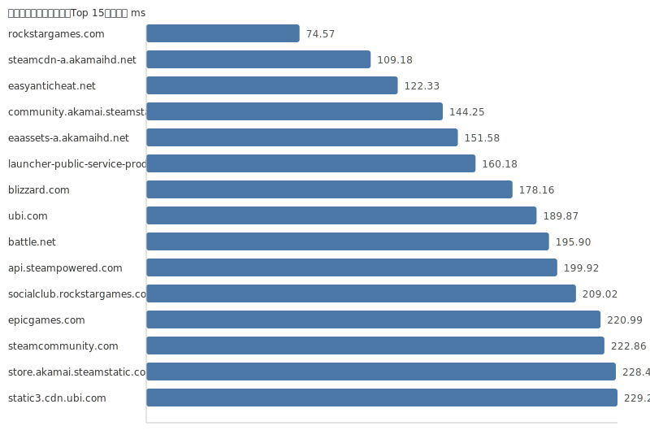

数据更新时间: 2025-10-28 05:21:09

分层统计: TLS ✅ 29/29 | TCP(443) ✅ 29/29 | TCP(80) ✅ 29/29 | HTTP(80) ✅ 29/29 | HTTPS(443) ✅ 29/29

### 可视化

#### 延迟柱状图（Top 15）

| 域名 | IP | TCP443 | TCP80 | TLS 握手 | HTTP(80) | 状态码 | HTTPS(443) | 状态码(HTTPS) | 延迟(ms) |
|---|---|---|---|---|---|---|---|---|---|
| [community.akamai.steamstatic.com](https://community.akamai.steamstatic.com/) | 23.220.246.16 | ✅ | ✅ | ✅ | ✅ | 403 | ✅ | 403 | 136.13 |
| [origin.com](https://origin.com/) | 23.61.23.194 | ✅ | ✅ | ✅ | ✅ | 301 | ✅ | 301 | 125.47 |
| [store.akamai.steamstatic.com](https://store.akamai.steamstatic.com/) | 23.220.246.29 | ✅ | ✅ | ✅ | ✅ | 403 | ✅ | 403 | 90.86 |
| [steamcdn-a.akamaihd.net](https://steamcdn-a.akamaihd.net/) | 23.54.76.12 | ✅ | ✅ | ✅ | ✅ | 200 | ✅ | 200 | 115.92 |
| [easyanticheat.net](https://easyanticheat.net/) | 104.18.3.180 | ✅ | ✅ | ✅ | ✅ | 301 | ✅ | 301 | 207.52 |
| [launcher-public-service-prod06.ol.epicgames.com](https://launcher-public-service-prod06.ol.epicgames.com/) | 104.18.13.27 | ✅ | ✅ | ✅ | ✅ | 404 | ✅ | 404 | 248.33 |
| [cdn.akamai.steamstatic.com](https://cdn.akamai.steamstatic.com/) | 23.220.246.41 | ✅ | ✅ | ✅ | ✅ | 200 | ✅ | 200 | 260.37 |
| [api.steampowered.com](https://api.steampowered.com/) | 23.210.138.105 | ✅ | ✅ | ✅ | ✅ | 404 | ✅ | 404 | 271.5 |
| [www.steamcommunity.com](https://www.steamcommunity.com/) | 23.62.69.145 | ✅ | ✅ | ✅ | ✅ | 302 | ✅ | 302 | 281.12 |
| [epicgames.com](https://epicgames.com/) | 100.24.177.41 | ✅ | ✅ | ✅ | ✅ | 301 | ✅ | 302 | 279.0 |
| [unrealengine.com](https://unrealengine.com/) | 44.219.123.137 | ✅ | ✅ | ✅ | ✅ | 301 | ✅ | 301 | 257.18 |
| [steam-chat.com](https://steam-chat.com/) | 23.62.69.145 | ✅ | ✅ | ✅ | ✅ | 302 | ✅ | 404 | 303.53 |
| [fortnite.com](https://fortnite.com/) | 34.236.195.5 | ✅ | ✅ | ✅ | ✅ | 301 | ✅ | 301 | 258.32 |
| [ea.com](https://ea.com/) | 184.31.100.194 | ✅ | ✅ | ✅ | ✅ | 301 | ✅ | 301 | 113.04 |
| [steamcommunity.com](https://steamcommunity.com/) | 23.210.138.105 | ✅ | ✅ | ✅ | ✅ | 302 | ✅ | 200 | 351.07 |
| [ubi.com](https://ubi.com/) | 54.80.124.129 | ✅ | ✅ | ✅ | ✅ | 301 | ✅ | 301 | 133.42 |
| [cdn.cloudflare.steamstatic.com](https://cdn.cloudflare.steamstatic.com/) | 23.55.176.230 | ✅ | ✅ | ✅ | ✅ | 200 | ✅ | 200 | 419.23 |
| [eaassets-a.akamaihd.net](https://eaassets-a.akamaihd.net/) | 184.25.59.69 | ✅ | ✅ | ✅ | ✅ | 404 | ✅ | 404 | 90.3 |
| [store.steampowered.com](https://store.steampowered.com/) | 23.205.97.108 | ✅ | ✅ | ✅ | ✅ | 302 | ✅ | 200 | 453.43 |
| [rockstargames.com](https://rockstargames.com/) | 23.62.93.22 | ✅ | ✅ | ✅ | ✅ | 301 | ✅ | 301 | 80.98 |
| [static3.cdn.ubi.com](https://static3.cdn.ubi.com/) | 23.196.49.60 | ✅ | ✅ | ✅ | ✅ | 401 | ✅ | 401 | 140.05 |
| [battle.net](https://battle.net/) | 166.117.114.163 | ✅ | ✅ | ✅ | ✅ | 301 | ✅ | 301 | 145.34 |
| [blizzard.com](https://blizzard.com/) | 166.117.214.166 | ✅ | ✅ | ✅ | ✅ | 302 | ✅ | 302 | 130.35 |
| [socialclub.rockstargames.com](https://socialclub.rockstargames.com/) | 104.255.105.71 | ✅ | ✅ | ✅ | ✅ | 301 | ✅ | 307 | 154.41 |
| [ubisoft.com](https://ubisoft.com/) | 18.244.214.10 | ✅ | ✅ | ✅ | ✅ | 301 | ✅ | 301 | 324.69 |
| [gog.com](https://gog.com/) | 151.101.1.55 | ✅ | ✅ | ✅ | ✅ | 301 | ✅ | 301 | 636.9 |
| [uplay.com](https://uplay.com/) | 3.248.153.37 | ✅ | ✅ | ✅ | ✅ | 301 | ✅ | 301 | 360.81 |
| [gogalaxy.com](https://gogalaxy.com/) | 77.79.249.231 | ✅ | ✅ | ✅ | ✅ | 301 | ✅ | 301 | 487.98 |
| [battlenet.com.cn](https://battlenet.com.cn/) | 118.31.67.128 | ✅ | ✅ | ✅ | ✅ | 308 | ✅ | 302 | 1033.43 |

提示：分层检测：TCP(443/80)→TLS握手→HTTP(80/HTTPS(443))。此测试为网络侧可达性参考，游戏实际连接可能需其他端口与协议。