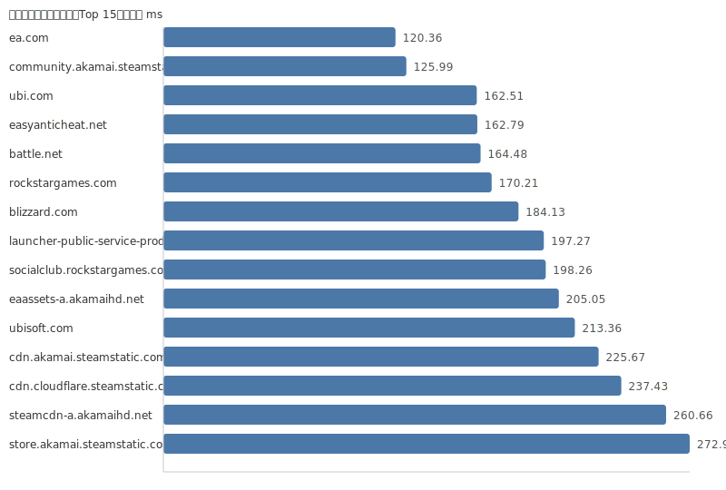

数据更新时间: 2025-10-10 04:26:48

分层统计: TLS ✅ 29/29 | TCP(443) ✅ 29/29 | TCP(80) ✅ 29/29 | HTTP(80) ✅ 29/29 | HTTPS(443) ✅ 29/29

### 可视化

#### 延迟柱状图（Top 15）

| 域名 | IP | TCP443 | TCP80 | TLS 握手 | HTTP(80) | 状态码 | HTTPS(443) | 状态码(HTTPS) | 延迟(ms) |
|---|---|---|---|---|---|---|---|---|---|
| [fortnite.com](https://fortnite.com/) | 3.210.15.223 | ✅ | ✅ | ✅ | ✅ | 301 | ✅ | 301 | 95.72 |
| [unrealengine.com](https://unrealengine.com/) | 52.55.253.216 | ✅ | ✅ | ✅ | ✅ | 301 | ✅ | 301 | 113.87 |
| [community.akamai.steamstatic.com](https://community.akamai.steamstatic.com/) | 23.12.146.143 | ✅ | ✅ | ✅ | ✅ | 403 | ✅ | 403 | 170.28 |
| [origin.com](https://origin.com/) | 23.213.79.115 | ✅ | ✅ | ✅ | ✅ | 301 | ✅ | 301 | 179.67 |
| [launcher-public-service-prod06.ol.epicgames.com](https://launcher-public-service-prod06.ol.epicgames.com/) | 104.18.13.27 | ✅ | ✅ | ✅ | ✅ | 404 | ✅ | 404 | 217.81 |
| [store.akamai.steamstatic.com](https://store.akamai.steamstatic.com/) | 23.12.146.157 | ✅ | ✅ | ✅ | ✅ | 403 | ✅ | 403 | 216.45 |
| [cdn.akamai.steamstatic.com](https://cdn.akamai.steamstatic.com/) | 23.12.146.141 | ✅ | ✅ | ✅ | ✅ | 200 | ✅ | 200 | 206.5 |
| [epicgames.com](https://epicgames.com/) | 44.193.146.34 | ✅ | ✅ | ✅ | ✅ | 301 | ✅ | 302 | 183.44 |
| [steamcommunity.com](https://steamcommunity.com/) | 23.214.233.226 | ✅ | ✅ | ✅ | ✅ | 302 | ✅ | 200 | 265.16 |
| [cdn.cloudflare.steamstatic.com](https://cdn.cloudflare.steamstatic.com/) | 23.54.127.112 | ✅ | ✅ | ✅ | ✅ | 200 | ✅ | 200 | 235.44 |
| [easyanticheat.net](https://easyanticheat.net/) | 104.18.3.180 | ✅ | ✅ | ✅ | ✅ | 301 | ✅ | 301 | 283.74 |
| [steamcdn-a.akamaihd.net](https://steamcdn-a.akamaihd.net/) | 23.54.76.12 | ✅ | ✅ | ✅ | ✅ | 200 | ✅ | 200 | 244.74 |
| [steam-chat.com](https://steam-chat.com/) | 23.213.69.74 | ✅ | ✅ | ✅ | ✅ | 302 | ✅ | 404 | 289.54 |
| [www.steamcommunity.com](https://www.steamcommunity.com/) | 23.213.69.74 | ✅ | ✅ | ✅ | ✅ | 302 | ✅ | 302 | 265.87 |
| [api.steampowered.com](https://api.steampowered.com/) | 23.214.233.226 | ✅ | ✅ | ✅ | ✅ | 404 | ✅ | 404 | 320.0 |
| [ea.com](https://ea.com/) | 23.62.166.177 | ✅ | ✅ | ✅ | ✅ | 301 | ✅ | 301 | 114.22 |
| [ubisoft.com](https://ubisoft.com/) | 18.67.76.67 | ✅ | ✅ | ✅ | ✅ | 301 | ✅ | 301 | 125.44 |
| [ubi.com](https://ubi.com/) | 52.70.215.58 | ✅ | ✅ | ✅ | ✅ | 301 | ✅ | 301 | 111.61 |
| [store.steampowered.com](https://store.steampowered.com/) | 23.48.9.171 | ✅ | ✅ | ✅ | ✅ | 302 | ✅ | 200 | 429.53 |
| [battle.net](https://battle.net/) | 166.117.114.163 | ✅ | ✅ | ✅ | ✅ | 301 | ✅ | 301 | 123.44 |
| [blizzard.com](https://blizzard.com/) | 166.117.214.166 | ✅ | ✅ | ✅ | ✅ | 302 | ✅ | 302 | 107.99 |
| [rockstargames.com](https://rockstargames.com/) | 96.7.20.214 | ✅ | ✅ | ✅ | ✅ | 301 | ✅ | 301 | 41.69 |
| [eaassets-a.akamaihd.net](https://eaassets-a.akamaihd.net/) | 23.62.230.162 | ✅ | ✅ | ✅ | ✅ | 404 | ✅ | 404 | 82.1 |
| [socialclub.rockstargames.com](https://socialclub.rockstargames.com/) | 104.255.105.71 | ✅ | ✅ | ✅ | ✅ | 301 | ✅ | 307 | 73.61 |
| [static3.cdn.ubi.com](https://static3.cdn.ubi.com/) | 23.196.49.60 | ✅ | ✅ | ✅ | ✅ | 401 | ✅ | 401 | 211.66 |
| [gog.com](https://gog.com/) | 151.101.129.55 | ✅ | ✅ | ✅ | ✅ | 301 | ✅ | 301 | 686.57 |
| [uplay.com](https://uplay.com/) | 52.31.3.176 | ✅ | ✅ | ✅ | ✅ | 301 | ✅ | 301 | 312.27 |
| [gogalaxy.com](https://gogalaxy.com/) | 77.79.249.231 | ✅ | ✅ | ✅ | ✅ | 301 | ✅ | 301 | 434.51 |
| [battlenet.com.cn](https://battlenet.com.cn/) | 120.55.44.14 | ✅ | ✅ | ✅ | ✅ | 308 | ✅ | 302 | 1036.34 |

提示：分层检测：TCP(443/80)→TLS握手→HTTP(80/HTTPS(443))。此测试为网络侧可达性参考，游戏实际连接可能需其他端口与协议。